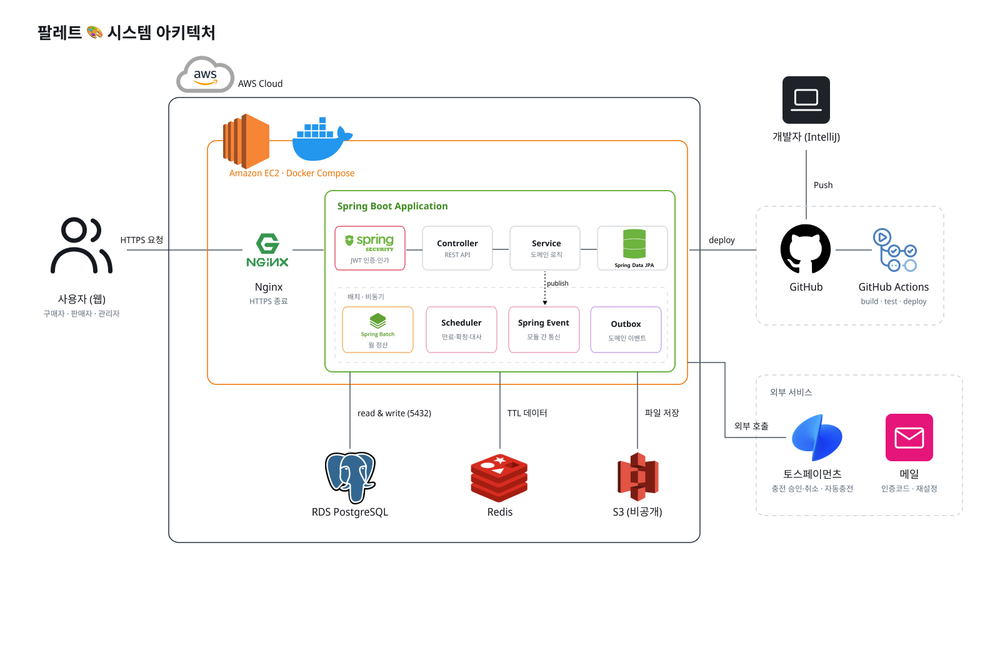

# 팔레트 (Palette)

> 다양한 셀러의 뷰티·의류 상품으로 나만의 취향을 완성하는 입점형 이커머스 플랫폼

팔레트는 여러 판매자가 입점해 상품을 팔고, 플랫폼이 중개·결제·정산을 맡는 백엔드 서비스입니다. 모든 주문은 토스페이먼츠로 충전한 **예치금**으로 결제하고, 결제 금액은 구매 확정 전까지 플랫폼이 보관(홀딩)했다가 매월 10일 수수료 10%를 뺀 금액을 판매자에게 정산합니다.

- 개발 기간: 2026.10.08 ~ 2026.10.18
- 문서: [기획서](docs/palette_proposal.md) · [정책](docs/palette_policy.md) · [예외 처리](docs/exception-handling.md) · ERD(`docs/palette.erd`)

## 주요 기능

| 기능 | 내용 |
| --- | --- |
| 회원/인증 | 이메일 인증 가입(가입 시 예치금 지갑 생성), JWT 로그인, 회원 탈퇴 |
| 판매자 | 입점 신청 → 관리자 승인(SELLER 권한), 철회 요청, 관리자 제재 |
| 상품 | 상품 등록·수정·삭제, 판매 중지 요청·심사, 2단계 카테고리(뷰티/의류), 재고 조정·이력 |
| 검색 | 상품명·카테고리 검색, 최신/가격순 정렬, 품절 제외 |
| 장바구니·주문 | 여러 판매자 상품을 한 주문으로, 주문 생성 시 재고 예약(15분 미결제 시 만료), 결제 전 취소, 반품(1회), 결제 후 7일 자동 구매 확정 |
| 예치금·결제 | 토스페이먼츠 충전(1만 원 단위), 지갑 → 홀딩 결제, 미사용 충전 건 취소, 반품 환불 |
| 월 정산 | 구매 확정 시 정산 후보 생성, 매월 10일 Spring Batch 정산, 실패 시 재시도·수동 정산 |
| 관리자 | 판매자 심사·제재, 판매 중지, 반품 승인, 실패 거래 조회, 정산 관리 |

## 기술 스택

| 구분 | 기술 |
| --- | --- |
| Language | Java 21 |
| Framework | Spring Boot 4.1.1 (Web MVC, Data JPA, Validation, Batch) |
| Database | PostgreSQL 17 |
| Build | Gradle 9.7.1 (Kotlin DSL) |
| API 문서 | springdoc-openapi 3.1.1 (Swagger UI) |
| Infra | Docker Compose (로컬 DB) |
| 기타 | Lombok, Spring Boot DevTools |
| 도입 예정 | Spring Security + JWT, Redis(인증코드·Refresh Token), 토스페이먼츠 |
| 협업 | GitHub, Jira(이슈 자동 연동) |

## 아키텍처

v1은 Spring Boot 단일 애플리케이션이지만 모듈 경계를 서비스 경계처럼 지켜, 나중에 모듈 단위로 MSA 분리할 수 있게 설계합니다.

- 도메인을 `member`, `product`, `order`, `payment`, `settlement` 5개 컨텍스트로 나누고, 각 컨텍스트는 `in / app / domain / out` 헥사고날(포트-어댑터) 레이어를 가집니다.
- 컨텍스트끼리는 `shared`의 이벤트·DTO로만 의존합니다.
- 구매 확정·반품 승인처럼 시점이 다른 처리는 Outbox 이벤트로 연결합니다.



## 프로젝트 구조

```
src/main/java/com/backend
├── Application.java
├── boundedContext            # 도메인 컨텍스트
│   ├── member                #   회원·판매자
│   ├── product               #   상품·카테고리·재고
│   ├── order                 #   장바구니·주문
│   ├── payment               #   예치금·충전·결제·환불
│   └── settlement            #   월 정산
│       ├── in                #     컨트롤러, 스케줄러, 이벤트 리스너
│       ├── app               #     유스케이스, 포트
│       ├── domain            #     엔티티, 상태 규칙, ErrorCode
│       └── out               #     Repository, 외부 연동 어댑터
├── shared                    # 컨텍스트 간 이벤트·DTO
├── global                    # 공통 설정
│   ├── batch                 #   Spring Batch 설정
│   ├── eventPublisher        #   이벤트 발행
│   ├── exception             #   DomainException, ErrorCode, GlobalExceptionHandler
│   ├── jpa/entity            #   BaseEntity
│   └── rsData                #   공통 응답 RsData
└── standard                  # 유틸리티
```

## 실행 방법

### 사전 준비

- JDK 21
- Docker, Docker Compose

### 1. 저장소 받기

```bash
git clone https://github.com/prgrms-be-adv-devcourse/beadv8_2_TRSS_BE.git
cd beadv8_2_TRSS_BE
```

### 2. 데이터베이스 실행

```bash
docker compose up -d
```

PostgreSQL 17 컨테이너(`palette-postgres`)가 `localhost:5432`에 뜹니다. 기본 계정은 DB `palette` / 사용자 `palette` / 비밀번호 `palette`입니다.

### 3. 애플리케이션 실행

```bash
./gradlew bootRun
```

Windows에서는 `gradlew.bat bootRun`을 사용합니다. IntelliJ에서는 `Application.java`를 실행해도 됩니다.

### 4. 확인

- API 서버: http://localhost:8080
- Swagger UI: http://localhost:8080/swagger-ui/index.html

### 테스트

```bash
./gradlew test
```

### 환경 변수

기본값으로 로컬 Docker DB에 접속합니다. 다른 DB를 쓰려면 아래 값을 바꿉니다.

| 변수 | 기본값 | 설명 |
| --- | --- | --- |
| `DB_HOST` | `localhost` | DB 호스트 |
| `DB_PORT` | `5432` | DB 포트 |
| `DB_NAME` | `palette` | DB 이름 |
| `DB_USERNAME` | `palette` | DB 사용자 |
| `DB_PASSWORD` | `palette` | DB 비밀번호 |

## API 규칙

- Base URL: `/api/v1`
- 인증: `Authorization: Bearer <Access Token>`. 판매자 API는 `/seller/**`, 관리자 API는 `/admin/**`
- 응답: 성공·실패 모두 `RsData { resultCode, msg, data }`. HTTP 상태는 `resultCode` 앞자리와 같습니다. 성공은 생성 포함 모두 200(`200-1`)입니다

```json
{ "resultCode": "200-1", "msg": "주문이 생성되었습니다.", "data": { "orderId": 123 } }
{ "resultCode": "402-INSUFFICIENT_BALANCE", "msg": "예치금 잔액이 부족합니다.", "data": { "shortage": 18000 } }
```

전체 API 목록은 [기획서 3장](docs/palette_proposal.md), 오류 코드는 [예외 처리 가이드](docs/exception-handling.md)를 참고하세요.


## 협업 규칙

- 브랜치: `main`(배포) ← `develop`(통합) ← `{type}/TRSS-{이슈번호}-{설명}`
  - 예: `feature/TRSS-8-signup-email-auth`, `chore/TRSS-9-docs`
- 이슈: GitHub 이슈를 만들면 Jira에 자동으로 등록됩니다(`.github/workflows/jira-issue-sync.yml`)
- PR: `develop`으로 보내고, PR 템플릿의 체크리스트를 채웁니다
