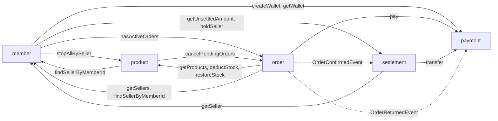

# 개발 가이드

팔레트 백엔드를 개발할 때 다섯 명이 똑같이 지킬 규칙을 정리한 문서입니다. 컨텍스트 간 계약(인터페이스·DTO·이벤트)의 초안은 [shared 계약](palette_shared_contract.md)에 있습니다.

- 구조: Facade · UseCase · Support, `in / app / domain / out`, 이벤트 리스너를 따릅니다.
- 관련 문서: [기획서](palette_proposal.md) · [정책](palette_policy.md) · [예외 처리](palette_exception_handling.md) · ERD(`palette.erd`)

## 1. 패키지 구조

```
com.backend
├── boundedContext
│   └── <ctx>                     # member, product, order, payment, settlement
│       ├── in                    # 컨트롤러, 이벤트 리스너, 스케줄러, DataInit, <Ctx>ApiAdapter
│       │   └── dto               #   요청·응답 DTO (이 컨텍스트 안에서만 사용)
│       ├── app                   # <Ctx>Facade, <Ctx><Verb>UseCase, <Ctx>Support
│       ├── domain                # 엔티티, 상태 enum, <Ctx>Policy, <Ctx>ErrorCode
│       └── out                   # Repository, 외부 연동 클라이언트(토스, 메일)
├── shared
│   └── <ctx>                     # 다른 컨텍스트에 공개하는 계약
│       ├── dto                   #   record DTO, 공개 enum
│       ├── event                 #   이벤트 record
│       └── out                   #   <Ctx>Api 인터페이스
├── global                        # 공통 설정, BaseEntity, RsData, 예외, 이벤트 발행, 배치
└── standard                      # 유틸리티
```

| 레이어 | 하는 일 | 하지 않는 일 |
| --- | --- | --- |
| `in` | 요청을 받아 검증하고 Facade를 호출해 `RsData`로 응답 | 비즈니스 로직, 트랜잭션 |
| `app` | 유스케이스 흐름 조립, 트랜잭션 경계(Facade), 다른 컨텍스트 Api 호출 | HTTP·JSON 처리 |
| `domain` | 상태 전이 규칙, 금액 계산, 불변식 검사 | Repository·다른 컨텍스트 호출 |
| `out` | DB 접근, 외부 API 호출 | 비즈니스 판단 |

## 2. 이름 규칙

| 대상 | 규칙 | 예 |
| --- | --- | --- |
| Facade | `<Ctx>Facade` (컨텍스트당 1개, 유일한 진입점) | `OrderFacade` |
| 유스케이스 | `<Ctx><Verb><Noun>UseCase` (기능 1개 = 클래스 1개) | `OrderCreateOrderUseCase`, `PaymentPayUseCase` |
| 공통 조회 | `<Ctx>Support` (여러 UseCase가 함께 쓰는 조회) | `OrderSupport` |
| 컨트롤러 | `ApiV1<Name>Controller` | `ApiV1OrderController`, `ApiV1AdminOrderController` |
| 계약 인터페이스 | `shared/<ctx>/out/<Ctx>Api` | `ProductApi` |
| 계약 구현체 | `boundedContext/<ctx>/in/<Ctx>ApiAdapter` | `ProductApiAdapter` |
| 이벤트 | `<대상><과거형>Event`, record | `OrderConfirmedEvent` |
| DTO | 공개용 `<Name>Dto`, 요청 `<Name>Request`, 응답 `<Name>Response`, 동기 호출 입력 `<Name>Command`, 모두 record | `ProductSnapshotDto`, `PayCommand` |
| 오류 코드 | `<Ctx>ErrorCode` enum (`domain`에 둠) | `OrderErrorCode.ORDER_EXPIRED` |
| 정책 값 | `<Ctx>Policy` (`custom.*`에서 주입) | `OrderPolicy.EXPIRE_MINUTES` |

- 메서드 이름은 동사로 시작합니다. 조회는 `get`(없으면 예외), `find`(Optional 반환), `exists`·`has`(boolean)로 구분합니다.
- Javadoc과 주석은 한국어로 씁니다.

## 3. 공통 타입 규칙

| 항목 | 규칙 |
| --- | --- |
| ID | `Long` (ERD가 BIGINT). 생성 전략은 `@GeneratedValue(strategy = GenerationType.IDENTITY)` |
| 금액 | `long`, 원 단위 정수. `double`·`BigDecimal`은 쓰지 않음. 수수료는 `price * rate / 100`(곱셈 먼저, 버림) |
| 시간 | `LocalDateTime`만 사용(`Instant`·`ZonedDateTime`·`Date`는 쓰지 않음), **KST(Asia/Seoul) 기준**. JVM 기본 시간대를 `Asia/Seoul`로 고정(`Application.main`, `build.gradle.kts`의 `-Duser.timezone`). 배포 서버·Docker·CI는 기본이 UTC라서, 설정하지 않으면 정산월 경계와 `@Scheduled` 실행 시각이 9시간 어긋남 |
| 상태값 | enum + `@Enumerated(EnumType.STRING)`. 값은 [정책 상태 코드](palette_policy.md)와 같은 이름 |
| 컬럼·필드 이름 | 컬럼은 snake_case, 필드는 camelCase. 생성·수정 시각은 필드 `createdAt` · `updatedAt` → 컬럼 `created_at` · `updated_at` |
| 테이블 생성 | `ddl-auto: update` (JPA가 엔티티 기준으로 생성·변경). 부분 유니크 인덱스·CHECK 제약은 만들어지지 않으므로, 꼭 필요한 중복 방지는 서비스 코드에서 먼저 검사합니다 |

## 4. 엔티티 규칙

- 모든 엔티티는 `BaseIdAndTime`을 상속합니다(`Long id`, `createdAt`, `updatedAt` 자동 기록).
- 테이블 이름은 **ERD 테이블 이름을 그대로** `@Table(name = "...")`로 지정합니다. 예: `Order` 엔티티 → `@Table(name = "market_order")`(`order`는 SQL 예약어). 컬럼 이름도 ERD를 따릅니다(camelCase 필드는 자동으로 snake_case 컬럼이 됨).
- **다른 컨텍스트의 엔티티를 `@ManyToOne`으로 참조하지 않습니다.** `Long buyerId`, `Long sellerId`처럼 ID만 저장합니다.
  - 같은 컨텍스트 안에서는 연관관계를 써도 됩니다(예: `Order` ↔ `OrderItem`).
  - 다른 컨텍스트의 값이 화면에 필요하면, 주문 항목처럼 그 시점 값을 복사(스냅샷)해 두거나 `<Ctx>Api`로 조회합니다.
- 상태 변경은 엔티티 메서드로만 합니다(`order.cancel(CancelType.USER)`). 메서드 안에서 현재 상태를 검사하고, 잘못된 전이면 `DomainException`을 던집니다.
- `@Setter`는 쓰지 않습니다. 생성은 생성자 또는 정적 팩토리(`Order.create(...)`)로 합니다.
- 다른 컨텍스트에 넘길 때는 엔티티에 `toDto()`를 두고 DTO로 변환합니다.

## 5. 트랜잭션 규칙

- `@Transactional`은 **Facade 메서드에만** 붙입니다. 조회는 `@Transactional(readOnly = true)`입니다.
  - 컨트롤러에는 붙이지 않습니다.
- Facade는 **엔티티가 아니라 DTO를 반환**합니다. `open-in-view: false`라서 컨트롤러에서 지연 로딩을 하면 오류가 납니다.
- 예외적으로 별도 트랜잭션이 필요한 경우(결제 실패 기록 등)는 별도 빈에 `@Transactional(propagation = REQUIRES_NEW)`를 둡니다. 같은 클래스 안에서 호출하면 적용되지 않습니다. → [예외 처리 8.1](palette_exception_handling.md)
- 외부 호출(토스, 메일)은 DB 트랜잭션 밖에서 합니다.
- 경쟁이 생기는 상태 변경(결제 vs 만료)은 조건부 UPDATE(`where status in (...)`)나 `@Version`으로 막습니다.

## 6. 컨텍스트 간 통신

### 6.1 세 가지 방식

| 방식 | 언제 쓰나 | 구현 |
| --- | --- | --- |
| **동기 Api** | 결과가 바로 필요하거나 같은 트랜잭션이어야 할 때 | `shared/<ctx>/out/<Ctx>Api` 인터페이스 → 제공 컨텍스트의 `<Ctx>ApiAdapter`가 구현 |
| **이벤트** | 끝난 일을 알리고, 후속 처리가 실패해도 원래 요청은 성공이어야 할 때 | `shared/<ctx>/event` record + `@TransactionalEventListener(AFTER_COMMIT)` |
| **Outbox 이벤트** | 유실되면 돈이 틀어지는 이벤트 (`OrderConfirmed`, `OrderReturned`) | `outbox_event` 테이블에 같은 트랜잭션으로 기록 → 폴러가 발행 |

기획서가 같은 트랜잭션을 요구하므로(주문 생성 + 재고 차감, 결제 + 주문 PAID) 동기 호출은 Java 인터페이스로 합니다. MSA로 나눌 때는 `<Ctx>Api` 구현체만 `RestClient` 기반으로 바꾸면 됩니다.

### 6.2 동기 Api 규칙

```java
// shared/product/out/ProductApi.java — 계약 (다른 컨텍스트는 이것만 import)
public interface ProductApi {
    void deductStock(List<StockChangeDto> items);
}

// boundedContext/product/in/ProductApiAdapter.java — 구현 (상품 담당자 소유)
@Component
public class ProductApiAdapter implements ProductApi {
    private final ProductFacade productFacade;

    public ProductApiAdapter(@Lazy ProductFacade productFacade) {   // 순환 참조 방지
        this.productFacade = productFacade;
    }

    @Override
    public void deductStock(List<StockChangeDto> items) {
        productFacade.deductStock(items);   // Facade의 @Transactional(REQUIRED)이 호출한 쪽 트랜잭션에 참여
    }
}
```

- 다른 컨텍스트는 `shared.*`만 import합니다. `boundedContext.<다른 ctx>.*`를 import하면 안 됩니다.
- Adapter는 Facade를 호출하는 일만 합니다. 로직은 UseCase에 둡니다.
- **Adapter는 Facade를 `@Lazy`로 주입합니다.** 상품 ↔ 주문, 회원 ↔ 주문처럼 서로 호출하는 컨텍스트가 있어서, 그냥 주입하면 앱이 시작할 때 순환 참조 오류가 납니다.
  - Lombok `@RequiredArgsConstructor`를 쓰려면 `lombok.config`에 `lombok.copyableAnnotations += org.springframework.context.annotation.Lazy`를 추가합니다.
- 실패는 `DomainException`으로 던집니다. 단, 호출한 쪽이 결과를 보고 판단해야 하는 실패(잔액 부족 등)는 결과 DTO로 반환합니다. 어느 쪽인지는 인터페이스 Javadoc에 적습니다.
- 파라미터와 반환값은 `shared` DTO와 기본 타입만 씁니다. 엔티티를 넘기지 않습니다.
- 구현이 아직 없으면 제공하는 쪽이 Adapter에 임시 구현(고정값 반환 또는 `UnsupportedOperationException`)을 먼저 넣어 둡니다. 다른 사람이 Fake 빈을 따로 만들면 빈이 두 개가 됩니다.

### 6.3 호출 방향



실선은 동기 Api, 점선은 Outbox 이벤트입니다. 결제(payment)는 다른 컨텍스트를 호출하지 않습니다.

### 6.4 이벤트 규칙

```java
// shared/order/event/OrderConfirmedEvent.java
public record OrderConfirmedEvent(Long orderId, Long buyerId, LocalDateTime confirmedAt,
                                  List<ConfirmedOrderItemDto> items) { }

// boundedContext/settlement/in/SettlementEventListener.java
@Component
@RequiredArgsConstructor
public class SettlementEventListener {
    private final SettlementFacade settlementFacade;

    @TransactionalEventListener(phase = AFTER_COMMIT)
    @Transactional(propagation = REQUIRES_NEW)
    public void handle(OrderConfirmedEvent event) {
        settlementFacade.createCandidates(event);
    }
}
```

- 이벤트는 불변 record로 만들고, 받는 쪽이 다시 조회하지 않아도 되도록 필요한 값을 모두 담습니다.
- 리스너는 `AFTER_COMMIT` + `REQUIRES_NEW`를 쓰고 Facade 한 줄만 호출합니다.
- **같은 이벤트를 두 번 받아도 결과가 같아야 합니다(멱등).** 유니크 제약(`settlement_candidate.order_item_id`, `payment_refund.payment_id`)으로 중복을 막습니다.
- 발행은 엔티티의 `publishEvent(...)` 또는 `EventPublisher.publish(...)`로 합니다.

### 6.5 Outbox 도입 순서

1. **1단계 (개발 초반):** `OrderConfirmedEvent`, `OrderReturnedEvent`를 일반 이벤트(`AFTER_COMMIT`)로 발행해 주문 → 정산·결제 흐름을 먼저 연결합니다.
2. **2단계:** 주문 UseCase가 이벤트 대신 `outbox_event`에 같은 트랜잭션으로 기록합니다. 공통 폴러(`global`)가 PENDING 행을 읽어 같은 이벤트 record로 발행하고 PUBLISHED로 바꿉니다.

리스너 코드는 두 단계에서 바뀌지 않습니다. 2단계에서는 리스너를 `@EventListener` + `@Transactional`로 바꾸는 것만 확인합니다(폴러는 트랜잭션 밖에서 발행하므로).

## 7. API·컨트롤러 규칙

- 경로: `/api/v1/...`, 판매자 `/api/v1/seller/**`, 관리자 `/api/v1/admin/**`
- 응답: 성공·실패 모두 `RsData { resultCode, msg, data }`. 컨트롤러는 `RsData`를 그대로 반환하고 `ResponseEntity`로 감싸지 않습니다 → [예외 처리](palette_exception_handling.md)
  - 성공: 조회·생성·처리 모두 HTTP 200, `resultCode`는 `200-1` 하나만 씁니다(`201`·`202` 구분 없음). 완료·처리 중처럼 구분이 필요하면 `data.status`로 나눕니다
  - 실패: `{HTTP 상태}-{ERROR_NAME}`(예: `409-ORDER_EXPIRED`), HTTP 상태는 `GlobalExceptionHandler`가 맞춥니다
- 요청 DTO는 record + Bean Validation(`@NotBlank`, `@Positive` 등), 컨트롤러 파라미터에 `@Valid`
- Swagger: 컨트롤러에 `@Tag`, 메서드에 `@Operation(summary = "...")`
- **로그인 회원 꺼내기:** 컨트롤러는 아래 한 가지 방식만 씁니다. 꺼내는 코드는 시연님이 `global`에 만들어 공유합니다.
  - JWT 인증을 시연님이 구현 중입니다. 완성되면 Spring Security 인증 정보에서 회원 ID를 꺼내는 방식을 공유합니다.
  - 그 전까지 컨트롤러를 테스트해야 하면 테스트 코드에서 인증 정보를 직접 넣습니다(`@WithMockUser` 등).

## 8. 예외

- 규칙은 [예외 처리 가이드](palette_exception_handling.md)를 따릅니다.
- 컨텍스트마다 `domain/<Ctx>ErrorCode` enum을 만들고 `throw new DomainException(OrderErrorCode.ORDER_EXPIRED)`로 던집니다.
- 남의 리소스 접근은 404(`findByIdAndBuyerId` 등으로 조회), 역할·판매자 상태 위반은 403입니다.

## 9. 설정과 정책 값

정책 숫자는 코드에 직접 쓰지 않고 `application.yaml`의 `custom.*`에 둔 뒤 `<Ctx>Policy`로 읽습니다.

```yaml
custom:
  order:
    expireMinutes: 15          # 주문 생성 후 결제 제한 시간
    autoConfirmDays: 7         # 결제 후 자동 구매 확정
  payment:
    topupUnit: 10000           # 충전 단위·최소 금액
    topupMax: 1000000
    adminMemberId: 1           # 수수료(FEE)를 받는 관리자 지갑
  settlement:
    feeRate: 10                # 수수료율(%)
    payDayOfMonth: 10          # 매월 정산일
    maxAttempts: 3             # 최초 1회 + 재시도 2회
    retryIntervalMinutes: 10
```

## 10. 목록 조회

- 요청 파라미터: `page`(0부터), `size`(기본 20)
- 응답 `data` 형식:

```json
{
  "resultCode": "200-1",
  "msg": "주문 목록을 조회했습니다.",
  "data": {
    "items": [ { "orderId": 123 } ],
    "page": 0,
    "size": 20,
    "totalElements": 57,
    "totalPages": 3
  }
}
```

- 공통 record `PageResponse<T>(List<T> items, int page, int size, long totalElements, int totalPages)`를 `global`에 두고, `PageResponse.from(Page<T>)`로 변환합니다.

## 11. 초기 데이터

각 컨텍스트의 `<Ctx>DataInit`(`ApplicationRunner`)이 개발용 데이터를 넣습니다. 데이터가 이미 있으면 아무것도 하지 않습니다(멱등).

| `@Order` | DataInit | 넣는 데이터 |
| --- | --- | --- |
| 1 | `MemberDataInit` | **1번 관리자, 2번 판매자(APPROVED), 3번 구매자** + 각자 지갑 (ID 고정, `adminMemberId: 1`과 연결) |
| 2 | `ProductDataInit` | 카테고리(뷰티/의류 + 소분류), 2번 판매자의 상품 몇 개 |
| 3 | `PaymentDataInit` | 3번 구매자 지갑에 테스트 예치금 |
| 4 | `OrderDataInit` | (필요하면) 테스트 주문 |
| 5 | `SettlementDataInit` | (필요하면) 정산 후보 |

## 12. 테스트

- 도메인 규칙(상태 전이, 금액 계산)은 스프링 없이 단위 테스트로 검증합니다.
- UseCase 테스트에서 다른 컨텍스트 Api는 Mockito mock 또는 테스트용 Fake로 대신합니다.
- 컨텍스트를 넘나드는 흐름(주문 → 결제 → 확정 → 정산)은 `@SpringBootTest` 통합 테스트로 확인합니다. 로컬 Docker PostgreSQL을 씁니다.
- 동시성(결제 vs 만료, 재고 차감)은 `ExecutorService`로 동시에 요청하는 테스트를 하나 이상 둡니다.

## 13. 협업 규칙

- 브랜치: `main` ← `develop` ← `{type}/TRSS-{이슈번호}-{설명}`
- PR을 올리기 전에 최신 `develop`을 가져오고(`git merge origin/develop`) `./gradlew build`가 통과하는지 확인합니다.
- `global`, `shared`, `application.yaml`을 바꾸는 PR은 팀 전체 리뷰를 받습니다. 모두가 의존하는 파일이기 때문입니다.
- `shared` 계약을 바꿀 때는 그 Api를 호출하는 사람에게 먼저 알립니다.

## 14. 결정 사항과 남은 것

**결정함**

- [x] 테이블 생성: `ddl-auto: update`
- [x] 시간대: KST(`Asia/Seoul`)
- [x] ID 생성: `IDENTITY`
- [x] 생성·수정 시각 필드: `createdAt`, `updatedAt`
- [x] Adapter `@Lazy` 주입: `lombok.config`에 한 줄 추가
- [x] 시드 계정: 1 관리자, 2 판매자, 3 구매자
- [x] Facade는 DTO를 반환
- [x] Outbox: 1주차는 일반 이벤트, 2주차 초에 Outbox로 전환
- [x] 미정산 금액: 구매 확정된 금액만 (확정 전 주문은 포함하지 않음)
- [x] 목록 조회 형식: 10장
- [x] 결제 `PROCESSING`: 일단 두고, 개발하면서 쓰지 않으면 2주차에 제거

**남은 것**

- [ ] 로그인 회원 꺼내는 방식 (시연, JWT 구현 후 공유)
- [ ] 감사 로그 기록 방식 (팀 논의 후 결정)
